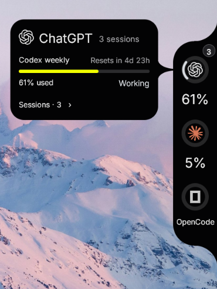

# Verge

A small desktop surface for keeping track of your AI coding agents: what is working, what needs your attention, and how much reported usage or context remains.



*Verge on Windows. Usage and session counts reflect the moment captured.*

Hover an agent to see its usage windows and reset times. Open **Sessions** to inspect individual sessions, their model, context and activity. **Back** returns to the account view; the arrows move between sessions.

## Current platform support

Verge is in development. The native shells have different levels of completeness.

| Platform | Status |
|---|---|
| **Windows** | Pre-release reference implementation: native Win32 surface, bundled Inter, agent discovery, session details, inactivity collapse and optional Claude approval controls. Native E2E checks pass. |
| **Linux** | Pre-release X11/XWayland baseline: local Codex data, provider/session navigation and inactivity collapse. Native CI passes on Ubuntu 24.04; final typography, theme, accessibility and monitor behavior remain unfinished. |
| **macOS** | Experimental AppKit shell targeting macOS 13+. GitHub-hosted macOS CI compiles Swift, validates the Rust presentation bridge, ad-hoc signs the app and creates its ZIP. Interactive native UI behavior remains unverified. |

Native Wayland and Linux/macOS direct approval controls are not implemented. See the [platform matrix](docs/design/PORTABILITY.md) and [latest E2E report](docs/design/E2E_PORTABILITY_2026-09-10.md).

The exact platform and distribution claims required for the first stable
release are defined by the [v1.0.0 support contract](docs/releases/V1_SUPPORT_CONTRACT.md).

## What it shows

The Windows surface provides the complete interaction below; Linux and macOS currently implement subsets described in the platform matrix.

- **Activity:** working animation, yellow for waiting, green for completed, red for stopped/error. Activity is independent of quota.
- **Usage:** reported limit windows, percentages and reset times. Missing readings stay unavailable rather than becoming an invented zero.
- **Sessions:** individual model/context details when the local source reports them. Context usage is separate from account quota.
- **Idle behavior:** after 30 seconds without interaction, the surface collapses. Hover reveals it; waiting/approval states hold attention according to the platform implementation.
- **Claude permissions on Windows:** a pending request replaces the agent's usage view. Approve/Deny decisions use the native broker; summarized actions require full review.

## Tools and data sources

| Tool | Current integration |
|---|---|
| **Claude** | Windows verified process/session metadata and optional status-line usage/context signals. Five-hour and weekly windows appear when reported. Linux/macOS can read existing usage metadata; their Claude setup/process integration is unfinished. |
| **ChatGPT / Codex** | Local Codex rollout metadata supplies usage windows, recent activity, model and context. The ChatGPT label does not mean browser or cloud conversations are monitored. Direct approval is not connected. |
| **Pi / KiloCode** | Windows discovery and local observer plugins for activity. Host reload may be required. These observers do not approve requests. |
| **Grok, Hermes, OpenCode, Cursor, Antigravity** | Windows discovery and limited process/observer information. Detection is not equivalent to quota, context or approval support. |

Reported activity can become stale. Installing an app does not prove an agent is working. See [provider discovery](docs/design/PROVIDER_DISCOVERY.md) and [session intelligence](docs/design/SESSION_INTELLIGENCE.md) for source-specific limits.

## Build and run

Use a current stable Rust toolchain. There is no documented minimum Rust version yet. Windows builds need the MSVC C++ build tools and Windows SDK; Linux needs a C linker and an X11 display; macOS needs Xcode command-line tools, Swift and Rust. Node.js is needed for observer scripts and their tests.

### Windows

From the repository root in PowerShell:

```powershell
./scripts/build-portable.ps1
./dist/windows/verge.exe --open
```

The archive is `dist/verge-windows-x64.zip`. Keep `verge.exe` and `verge-claude-hook.exe` together if you use the Claude gate. `--open` requests the expanded view; omit it for normal startup.

For a development build:

```powershell
cargo run -p verge-desktop --bin verge -- --open
```

### Linux

```sh
bash scripts/build-portable.sh
./dist/linux/verge
```

The archive is `dist/verge-linux-<architecture>.tar.gz`. It targets the build host's architecture and system libraries; it is not a universal static binary. An X11 server or XWayland session with `DISPLAY` set is required.

### macOS — experimental

On a Mac:

```sh
bash scripts/build-portable.sh
open dist/Verge.app
```

The script bundles the Rust reader and Inter with the AppKit shell, checks the presentation bridge, and ad-hoc signs the app. Developer ID signing, notarization and automatic updates are not included. Compilation and build-host bridge execution pass in macOS CI; launching and interacting with the panel still require native verification.

### Optional Claude approval setup

Read the [Claude setup and recovery guide](docs/design/CLAUDE_APPROVAL_SETUP.md) before installing the Windows hook. The current installer expects a particular existing status-line setup; it is not a general-purpose installer.

**When the hook is installed, keep Verge running.** If the helper executes but cannot reach its broker, it denies the request. Reload Claude after changing hook configuration. Moving a portable folder does not update an already registered absolute hook path.

## Local data and privacy

Verge interprets local tool metadata; it does not provide a separate provider sign-in or upload telemetry. The Windows Claude fallback reads the tool's local credential file and statistics cache. Codex metadata lives in rollout files that can also contain conversation content: Verge reads bounded portions of those files and extracts selected metadata fields, rather than displaying or persisting prompts.

Windows discovery can install missing observer files for supported tools. The optional Claude installer modifies hook/status-line configuration with backups. Approval review necessarily handles the proposed tool action. These are meaningful local writes and data accesses; see [security and privacy](SECURITY.md) before enabling integrations.

## Development

```sh
cargo fmt --all --check
cargo test --workspace
cargo check --workspace --all-targets
node scripts/integrations/test.mjs
```

On Windows, also run `node scripts/claude-signal.test.cjs`. Native UI checks, fixture setup and contribution guidance are in [CONTRIBUTING.md](CONTRIBUTING.md).

The code is split into a pure Rust domain (`core/`), tool adapters (`tools/`), native platform code (`platform/`), shared/native presentation (`ui/ambient/`), and application composition (`apps/desktop/`). The macOS Swift shell consumes a local Rust presentation bridge. [Architecture](docs/PRODUCT_ARCHITECTURE.md).

## Documentation

- [Documentation index](docs/README.md)
- [Troubleshooting](docs/TROUBLESHOOTING.md)
- [Contributing](CONTRIBUTING.md)
- [Security](SECURITY.md)
- [Unreleased changes](CHANGELOG.md)

Codenotch was a local design and native-platform reference. Verge has its own Rust domain, adapters and shells; Codenotch is not a runtime dependency.

## License

The repository currently reserves all rights; no public license has been granted. See [LICENSE](LICENSE). Third-party components retain their own terms, including Inter under SIL OFL; see [THIRD_PARTY_NOTICES.md](THIRD_PARTY_NOTICES.md). Build instructions and this guide do not change those terms.
