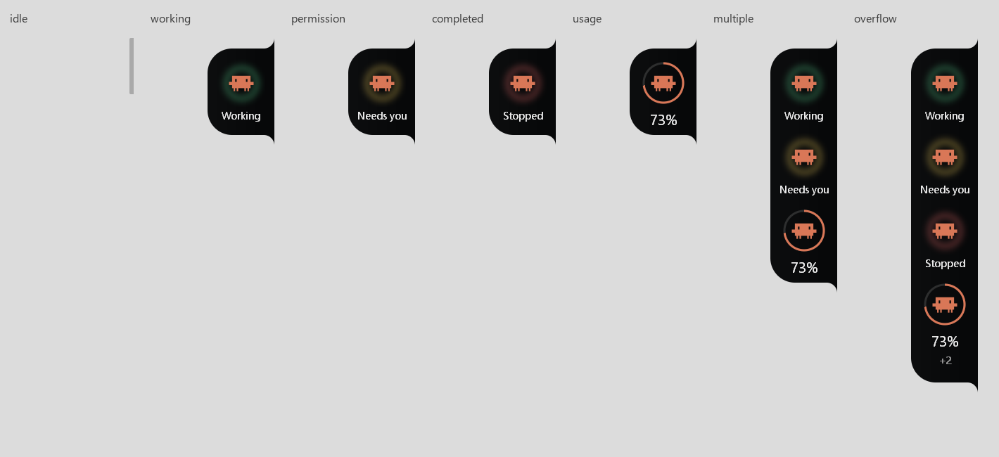
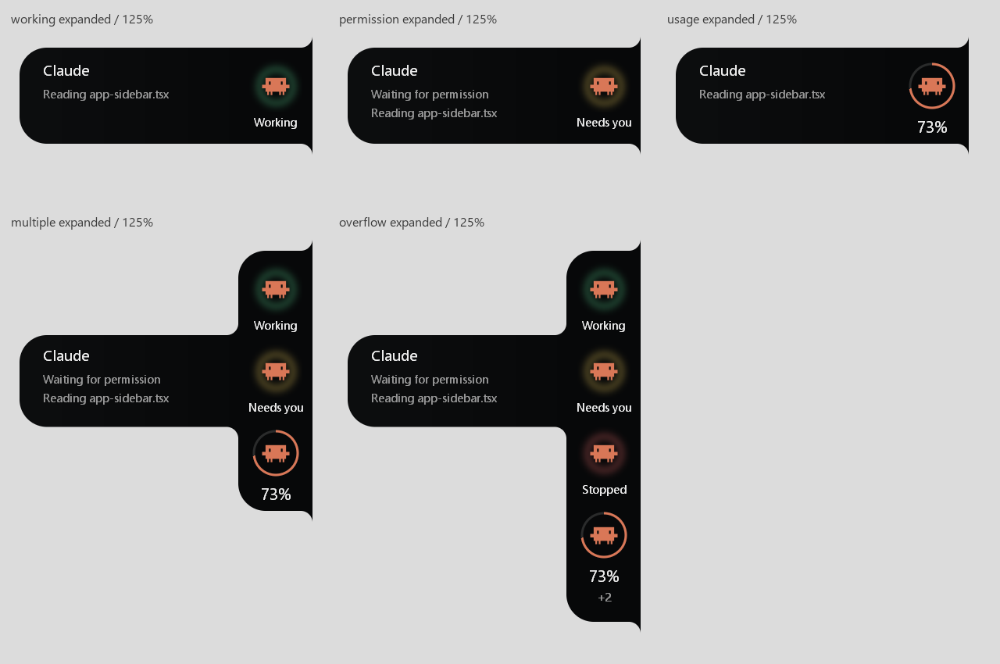
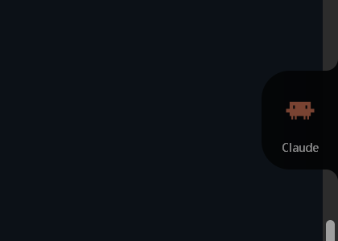
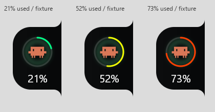

# Verge native ambient redesign — 2026-09-08

The user approved reviewing and implementing the attached brief, with the two images and `D:\codenotch` as references. Existing uncommitted work was preserved and extended. No reference application source was copied.

## 1. Creative diagnosis

The old renderer put a substitute text symbol inside a filled brand badge, then surrounded it with competing metric and state outlines. Expanded copy was small and diagnostic in character. The square edge join read as a rounded widget pushed against the display. Raw pixel sizes failed to account for 125% text sizing; changing text measurements changed expansion width. GDI bitmaps were deleted while still selected, and the window state could be released twice on shutdown.

## 2. Composition and reference comparison

| Dimension | Previous implementation | Reference principle translated |
|---|---|---|
| Composition | Expanding column of all details | Fixed identity rail; contextual detail for one identity |
| Silhouette | Rounded rectangle with square edge join | Inverse edge fillets and a connected, curved detail extension |
| Typography | Small cell-height GDI text, bold heading | Segoe UI at native DPI, regular weights and distinct numeral role |
| Material | More transparent gray surface, edge highlight | Dominant dense black with restrained local light |
| Spacing | Badge/ring stack with tiny text | Open space around bare marks and measured caption baselines |
| Hierarchy | Brand badge, two rings, multiple text lines | Identity first; local state or real usage; context on hover |
| State | Hard outline, orange permission tint | Green/yellow/red diffuse light and plain state captions |
| Motion | Width tied to text measurements | Fixed expansion distance, anchored identity, cubic settle and hover delays |
| Density | All supplied glyph details expand together | One contextual extension, four visible identities plus overflow |
| Edge | Physically flush but visually square | Black material curves into the bezel without a margin |

## 3. Design system

Shared Rust tokens own material, typography, rail dimensions, spacing, state palette, and motion. Compact width is 76 DIPs; expansion adds 224 DIPs. Identity positions remain unchanged through expansion. The same silhouette controls painting and pointer interaction, including the idle shape. No dependency was added.

## 4. Typography

Segoe UI regular: 15 DIP identity heading, 12 DIP context/captions, 17 DIP percentage. Negative GDI font heights select the intended em size. Grayscale antialiasing is explicit; text is rendered at physical DPI rather than stretching a bitmap. Long text receives an ellipsis; numerals are optically centered by measured width.

## 5. Color and material

Near-black RGB 5/6/7 at 246–253 alpha. Claude Code uses its supplied vector silhouette and #D97757, with upstream attribution retained. Real fractions receive a usage arc; bare counts do not receive a misleading ring. Aged readings dim the mark, number, track, and arc consistently. State light is localized and independent of brand color.

## 6. Motion

Expansion settles over 240 ms with cubic ease-out, a 100 ms hover entrance delay, and 220 ms exit delay. Direction reversals begin at the current progress. Working light travels only 0.65 DIP over a 12-second cycle; permission light makes one 600 ms, 1.2 DIP movement when content changes. Windows reduced-motion settings suppress these animations. Idle has no animation timer. The identity itself never bounces or scales.

## 7. States and truth

Idle, working, permission, stopped/completed, multiple identities, overflow, usage, and expanded states have isolated native fixtures. `NotMetered` becomes the idle sliver. Live Claude usage remains neutral because the core has no activity or session-count source. No agents, sessions, percentages, limits, or reset times were fabricated in the runtime. Reset text is shown only when an existing usage window supplies it. Other Windows integrations were not added.

## 8. Reference principles retained

Small ambient presence; black silhouette as identity; authentic tool recognition; circular usage instrumentation; curved edge attachment; low information density; one object revealing more information. The contextual extension stays connected to the rail instead of opening a separate dashboard.

## 9. Verification

- `cargo test --workspace`: **42 passed**.
- Renderer check: seven compositions, compact/mid/expanded at 100%, 125%, 150%, and 200% (**84 native renders**). Checks premultiplied alpha, fixed identity position, silhouette, and monotonic easing; additional assertions cover aged arcs and changing activity light.
- Formatting/reset test verifies `NotMetered` idle and a real 51-minute reset.
- `platform/windows/tests/window_contract.ps1`: actual desktop at **DPI 120 / 125%**, compact **95 px**, right edge **1920 px**, expansion/collapse, stable vertical/right anchor, dynamic `WS_EX_TRANSPARENT`, topmost/layered/toolwindow/noactivate flags. GDI objects **1 → 1**.
- Runtime rebuilt and relaunched; real-state screenshot saved below. All fixture processes were closed; the original pointer position was restored.
- Independent finish review accepted age treatment and hierarchy. Motion is verified in implementation and differing-frame assertions; the reviewer did not receive a recording for perceptual motion assessment.

The ordinary sandbox could not read/move the desktop cursor; the native check therefore ran with desktop access. An initial repeated check was interrupted by pointer movement; the final bounded check passed. No test result from either failed attempt is represented as a pass.

## 10. Remaining weaknesses

The existing core cannot support live working/permission/completion or session counts yet. Adding that source is outside this visual task. Material is native per-pixel translucency, without compositor backdrop refraction. The surface remains an informational no-activate overlay without a screen-reader text tree or keyboard detail navigation. State-content changes and selecting another identity are immediate; only compact expansion and state light are animated. Multi-monitor relocation and live reduced-motion setting changes were not validated. Native desktop validation was at 125%; other DPI values used the same renderer offscreen.

## Evidence

These contact sheets contain **synthetic renderer fixtures**, not live agent claims.

The following is the **real running application** with its actual neutral, aged Claude reading:

Reproduce fixture captures with `VERGE_VISUAL_DIR` set to an output directory and `cargo test -p verge-platform-windows native_visual_states_and_geometry`. Run the desktop contract after `cargo build -p verge-platform-windows --example visual_states` using `powershell -NoProfile -ExecutionPolicy Bypass -File platform/windows/tests/window_contract.ps1` while leaving the pointer still briefly. The script creates and closes its own fixture.

## Follow-up: exact Codenotch documents

Read the [original design spec](/D:/codenotch/docs/specs/2026-08-28-usage-notch-design.md), [implementation plan](/D:/codenotch/docs/plans/2026-08-28-usage-notch-plan.md), both original frames, and relevant sections of [Product Architecture](/D:/codenotch/docs/PRODUCT_ARCHITECTURE.md) and [Cross-platform Assessment](/D:/codenotch/docs/CROSS_PLATFORM_ASSESSMENT.md).

Corrections implemented from that evidence:

- Usage now communicates headroom, independently of the tool brand: 21% green, 52% yellow, 73% orange. The prose spec’s 80% orange threshold conflicts with its own frame; the reference `UsageBand.swift` explicitly resolves this to 70%. Verge follows that resolved interpretation.
- Usage arcs have antialiased round caps matching the source frames.
- Aged usage dims its reading, while independently current activity light/captions and permission copy remain visible. This preserves the architecture’s separate recency and activity facts.
- A dedicated native test checks the band boundaries, empty/full arcs, cap shape, and stale-usage/current-activity independence. All 42 workspace tests pass.

The documents are references, not blanket scope changes: the user's newer brief retains the connected expansion, subtle activity halo, brand-preserving identity, and no added settings/integrations or fabricated limits. The architecture document describes activity/session models that the current core still does not implement.

